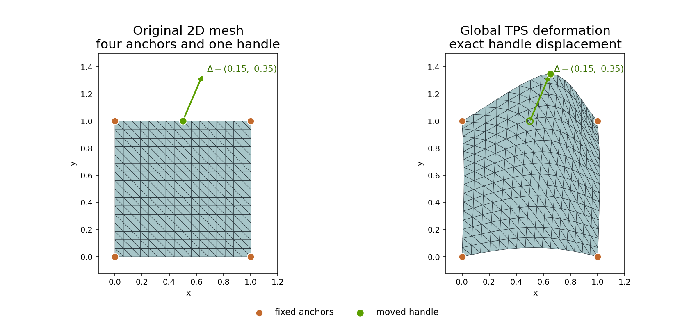
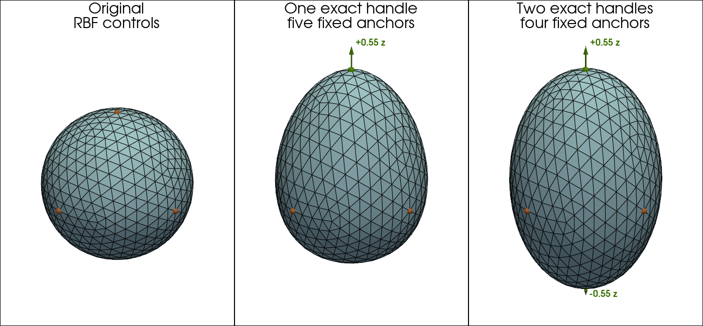
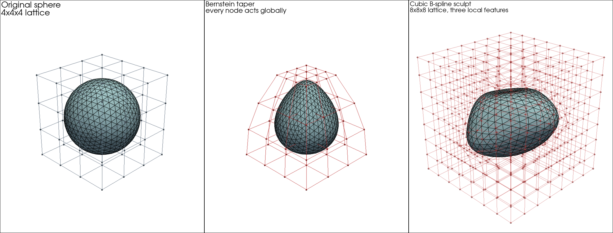

Transformations and Projections
===============================

Geometric Transformations
-------------------------

.. currentmodule:: physicsnemo.mesh.transformations.geometric

Linear and affine transformations on mesh geometry. Each function
returns a new :class:`~physicsnemo.mesh.mesh.Mesh` with transformed point
coordinates and appropriately invalidated caches. Cached quantities such as
normals and areas are automatically recomputed on next access.

All transformations are also available as methods on
:class:`~physicsnemo.mesh.mesh.Mesh`.

.. code:: python

    import numpy as np
    from physicsnemo.mesh.primitives.surfaces import sphere_icosahedral

    mesh = sphere_icosahedral.load(subdivisions=3)

    # Via Mesh methods
    translated = mesh.translate([1.0, 0.0, 0.0])
    rotated = mesh.rotate(axis=[0, 0, 1], angle=np.pi / 4)
    scaled = mesh.scale(2.0)
    scaled_aniso = mesh.scale([2.0, 1.0, 0.5])

    # Arbitrary linear transform
    import torch
    matrix = torch.eye(3) * 2
    transformed = mesh.transform(matrix)

.. automodule:: physicsnemo.mesh.transformations.geometric
   :members:
   :show-inheritance:

Deformations
------------

.. currentmodule:: physicsnemo.mesh.transformations.deform

The ``deform`` namespace provides four deformation families:

- Dense displacement through :func:`displace`, backed by
  :func:`~physicsnemo.nn.functional.displace_points`.
- Compact sparse-control morphing through :func:`morph`, backed by
  :func:`~physicsnemo.nn.functional.morph_points`.
- Global radial-basis deformation through
  :func:`radial_basis_function_deform`, backed by
  :func:`~physicsnemo.nn.functional.radial_basis_function_deform_points`.
- Lattice free-form deformation through :func:`free_form_deform`, backed by
  :func:`~physicsnemo.nn.functional.free_form_deform_points`.

Each operation is also available as a method on
:class:`~physicsnemo.mesh.mesh.Mesh`.

Dense displacement accepts a tensor or a point-data key (including a nested
tuple key). The operation returns a new mesh without changing ``mesh.points``.
Assigning a point-data key, as in the second example below, is a separate,
explicit mutation of the source mesh's attached data.

.. code:: python

    displacement = torch.zeros_like(mesh.points)
    displacement[:, 2] = 0.05
    displaced = mesh.displace(0.5 * displacement)

    # Point-data fields can drive the same operation.
    mesh.point_data["design_displacement"] = displacement
    displaced_from_data = mesh.displace("design_displacement")

Sparse controls are useful when only a small set of design handles is known. A
control point is a location in world coordinates, and its control displacement
is a vector rather than a destination coordinate. Control points do not need to
be mesh vertices, although selecting vertices makes their prescribed movement
directly visible in the result.

Single-Control Morphing
^^^^^^^^^^^^^^^^^^^^^^^

Indexing one vertex produces a coordinate vector with shape ``(3,)``. The
``morph`` API instead expects ``(n_controls, n_spatial_dims)``, so
``unsqueeze(0)`` adds the control dimension and gives shape ``(1, 3)``. It is
not a batch dimension.

.. code:: python

    top_index = mesh.points[:, 2].argmax()
    control_points = mesh.points[top_index].unsqueeze(0)  # (1, 3)
    control_displacements = mesh.points.new_tensor(
        [[0.0, 0.0, 0.5]], requires_grad=True
    )
    single_morph = mesh.morph(
        control_points,
        control_displacements,
        radius=1.0,
    )

    # Autograd continues through the returned point coordinates.
    objective = single_morph.points.square().mean()
    objective.backward()

``control_displacements`` is differentiable. An optimizer can learn it from any
differentiable loss computed from ``single_morph.points``. A model can also
predict the displacements.

Without point weights, a mesh vertex exactly at a unique control moves by its
prescribed displacement. ``point_weights`` can scale or mask the final movement.
Duplicate controls at the same coordinate contribute their mean displacement.

Multiple-Control Morphing
^^^^^^^^^^^^^^^^^^^^^^^^^

Advanced indexing retains the control dimension when several vertices are
selected. Each row of ``control_points`` pairs with the same row of
``control_displacements`` and, when supplied, one entry of ``radius``.

.. code:: python

    bottom_index = mesh.points[:, 2].argmin()
    control_indices = torch.stack((top_index, bottom_index))
    control_points = mesh.points[control_indices]  # (2, 3)
    control_displacements = mesh.points.new_tensor(
        [[0.0, 0.0, 0.5], [0.0, 0.0, -0.5]]
    )
    radii = mesh.points.new_tensor([1.0, 1.0])

    multiple_morph = mesh.morph(
        control_points,
        control_displacements,
        radius=radii,
    )

The radius is a Euclidean support distance in the same coordinate units as the
mesh. A control's influence vanishes smoothly at its support boundary. Where
supports overlap, all active controls are evaluated together using a stationary
zero-displacement background. The result is not a simple sum or average. Points
outside every support remain unchanged. Put simultaneous controls in one call,
because applying several morphs sequentially evaluates later fields on already
modified coordinates and is therefore order-dependent.

The ``kernel`` keyword names the compact radial kernel used by the field.
``"wendland_c2"`` is currently the supported value and the default.

Every tensor-valued radius must remain finite and strictly positive. Its values
are not validated at runtime. When a model learns the radius, use a positive
parameterization such as
``torch.nn.functional.softplus(raw_radius) + radius_epsilon`` rather than
optimizing an unconstrained radius directly. Floating ``point_weights`` are
used as supplied and may be signed or greater than one.

.. rubric:: Visualization

The panels compare the original sphere with the single-control and
multiple-control examples above. Green markers identify the displaced handle
locations, while arrows and labels show the prescribed displacement directions
and magnitudes.

.. figure:: ../../img/mesh/sphere_morphing.png
   :alt: Original sphere and single-control and multiple-control sphere morphing
   :width: 100%

Global Radial-Basis Deformation
^^^^^^^^^^^^^^^^^^^^^^^^^^^^^^^

Radial-basis deformation fits one global displacement field through sparse
handles. With zero smoothing and a nonsingular control layout, the fitted field
interpolates each prescribed control displacement up to solver precision.
Optional point weights are applied after interpolation. Unlike compact Shepard
morphing, every control generally influences every point. Fixed controls are
therefore useful as anchors.

The standard affine polynomial tail reproduces affine displacement fields. The
controls must affinely span the coordinate space, and the augmented system must
be nonsingular. This formulation follows the thin-plate-spline interpolant
described by Bookstein [1].

[1] F. L. Bookstein, "Principal warps: thin-plate splines and the decomposition
of deformations," IEEE Transactions on Pattern Analysis and Machine
Intelligence, vol. 11, no. 6, pp. 567-585, 1989.
https://doi.org/10.1109/34.24792

.. rubric:: Two-Dimensional Example

A mesh with ``n_spatial_dims=2`` requires at least three non-collinear controls
when the affine tail is enabled. This example fixes the four corners of a
triangulated square and moves a fifth handle at the midpoint of its upper edge.

.. code:: python

    import torch
    from physicsnemo.mesh.primitives.planar import unit_square

    mesh_2d = unit_square.load(subdivisions=4)
    controls_2d = mesh_2d.points.new_tensor(
        [[0.0, 0.0], [1.0, 0.0], [1.0, 1.0], [0.0, 1.0], [0.5, 1.0]]
    )
    displacements_2d = torch.zeros_like(controls_2d)
    displacements_2d[-1] = controls_2d.new_tensor([0.15, 0.35])

    deformed_2d = mesh_2d.radial_basis_function_deform(
        controls_2d,
        displacements_2d,
        kernel="thin_plate_spline",
        polynomial=True,
        smoothing=0.0,
    )

    handle_index = torch.linalg.vector_norm(
        mesh_2d.points - controls_2d[-1], dim=1
    ).argmin()
    torch.testing.assert_close(
        deformed_2d.points[handle_index],
        controls_2d[-1] + displacements_2d[-1],
        atol=2.0e-5,
        rtol=2.0e-5,
    )

The corner controls remain fixed while the upper edge and interior deform
smoothly. The hollow green marker in the output panel shows the handle's source
position.

.. rubric:: Three-Dimensional Example

In three dimensions, the affine tail requires at least four controls spanning
the coordinate space. Practical layouts usually use more. The sphere example
uses its six axis-extreme vertices as controls.

.. code:: python

    control_indices = torch.stack(
        (
            mesh.points[:, 2].argmax(),
            mesh.points[:, 2].argmin(),
            mesh.points[:, 0].argmax(),
            mesh.points[:, 0].argmin(),
            mesh.points[:, 1].argmax(),
            mesh.points[:, 1].argmin(),
        )
    )
    rbf_controls = mesh.points[control_indices]
    rbf_displacements = torch.zeros_like(rbf_controls)
    rbf_displacements[0, 2] = 0.55

    exact_rbf = mesh.radial_basis_function_deform(
        rbf_controls,
        rbf_displacements,
        kernel="thin_plate_spline",
        polynomial=True,
        smoothing=0.0,
    )

    torch.testing.assert_close(
        exact_rbf.points[control_indices],
        rbf_controls + rbf_displacements,
        atol=2.0e-5,
        rtol=2.0e-5,
    )

``smoothing=0.0`` interpolates the controls up to solver precision. A positive
smoothing value adds diagonal regularization. This deliberately relaxes
interpolation accuracy.

Both evaluation backends use PyTorch for the dense coefficient solve. The Warp
backend fuses evaluation over the mesh points without materializing its full
point/control kernel matrix.

Orange controls are fixed anchors. Green controls mark moved handles, and the
arrows show their displacement directions. The labels give the prescribed
magnitudes. With zero smoothing, the deformed surfaces interpolate all six
control displacements up to solver precision.

Lattice Free-Form Deformation
^^^^^^^^^^^^^^^^^^^^^^^^^^^^^

:meth:`~physicsnemo.mesh.mesh.Mesh.free_form_deform` defines a regular array of
control displacements over an axis-aligned evaluation box and deforms every
point inside the box by tensor-product basis interpolation.
Compared with sparse morphing, the design parameters form a structured grid of
fixed size, which suits parametric shape optimization. A lattice of zeros is
exactly the identity, and the same lattice deforms any geometry embedded in
the box.

When ``origin`` and ``extent`` are omitted, the box spans the mesh bounds. Each
coordinate axis must have positive range. Planar or linear geometry embedded
in a higher-dimensional space therefore needs an explicit positive extent.
Validating an automatically derived extent synchronizes with the device and is
not CUDA Graph capture-safe. For capture, pass both ``origin`` and ``extent``
as device tensors.

``basis="bernstein"`` provides classic global-support free-form deformation for
coarse lattices. ``basis="bspline"`` provides local four-node-per-axis support
and scales to fine lattices for local sculpting. Its first and last coefficient
planes lie one knot spacing outside the evaluation box. ``basis="linear"``,
``"cubic_hermite"``, and ``"quintic_hermite"`` instead use the two neighboring
nodes per axis and reproduce every control displacement at its lattice node.
For a local cell coordinate :math:`t`, their upper-node weights are
:math:`t`, :math:`3t^2-2t^3` (cubic Hermite), and
:math:`6t^5-15t^4+10t^3` (quintic Hermite), respectively. The lower-node
weight is one minus the upper-node weight. The resulting fields are C0, C1,
and C2 across cell boundaries, respectively. Perlin introduced the quintic
blend in `Improving Noise <https://doi.org/10.1145/566654.566636>`_ to
eliminate the cubic blend's second-derivative discontinuities.

.. code:: python

    # A 4x4x4 Bernstein lattice spans the mesh bounds.
    # Zero displacements start at the identity.
    control_displacements = torch.zeros(4, 4, 4, 3, requires_grad=True)
    deformed = mesh.free_form_deform(control_displacements)

    # Autograd continues through the returned point coordinates.
    objective = deformed.points.square().mean()
    objective.backward()

Points outside the lattice box are unchanged. The deformation is generally not
continuous across the box boundary. A sufficient condition for a fixed
exterior is to zero the outermost coefficient plane on every Bernstein or
node-interpolating face. For cubic B-splines, zero the first and last three
coefficient planes on every axis. ``origin`` and ``extent`` are
non-differentiable lattice parameters. Optimize ``control_displacements``
instead.

.. rubric:: Visualization

The panels compare the original sphere with two lattice deformations. A coarse
Bernstein lattice tapers the whole sphere because every node acts globally,
while three independently displaced regions in a finer cubic B-spline lattice
produce two local bulges and a local indentation.

Domain Meshes
^^^^^^^^^^^^^

:meth:`~physicsnemo.mesh.domain_mesh.DomainMesh.morph` evaluates one
world-coordinate control field on the interior and every named boundary. With
``point_weights=None``, coincident component points receive identical motion.
Domain point weights must instead be a point-data key (or nested tuple key)
present in every component. Raw weight tensors are rejected because component
point counts can differ. Every resolved field must use one common dtype across
the domain: bool for a hard mask, or the same floating dtype as the mesh points.
Coincident points remain coincident under a point-weight key only when their
resolved values also match.

:meth:`~physicsnemo.mesh.domain_mesh.DomainMesh.radial_basis_function_deform`
follows the same component and point-weight rules while fitting one global RBF
field. The coefficient system is solved once, and the combined interior and
boundary points are evaluated together before the component meshes are rebuilt.

.. code:: python

    import torch
    from physicsnemo.mesh import DomainMesh, Mesh

    interior = Mesh(
        points=torch.tensor([[0.0, 0.0], [1.0, 0.0], [0.0, 1.0]]),
        cells=torch.tensor([[0, 1, 2]]),
        point_data={"design_weight": torch.tensor([1.0, 0.8, 0.5])},
    )
    wall = Mesh(
        points=interior.points[:2],
        cells=torch.tensor([[0, 1]]),
        point_data={"design_weight": torch.tensor([1.0, 0.8])},
    )
    domain = DomainMesh(interior=interior, boundaries={"wall": wall})

    domain_controls = interior.points[[0]]  # (1, 2)
    domain_displacements = interior.points.new_tensor([[0.0, 0.25]])
    morphed_domain = domain.morph(
        domain_controls,
        domain_displacements,
        radius=1.25,
        point_weights="design_weight",
        implementation="torch",
    )

    # Equal point weights keep the shared wall vertices coincident.
    assert torch.allclose(
        morphed_domain.interior.points[:2],
        morphed_domain.boundaries["wall"].points,
    )

:meth:`~physicsnemo.mesh.domain_mesh.DomainMesh.free_form_deform` follows the
same pattern for lattice free-form deformation:

- The operation evaluates one lattice field over the combined interior and
  boundary points.
- The default box spans the combined component bounds.

The combined bounds must have positive range on every coordinate axis unless
an explicit extent is supplied.

Every deformation preserves connectivity and attached point, cell, global, and
domain data. These operations treat attached vector and tensor fields as
Lagrangian data and do not push them forward. They discard geometry-dependent
caches and recompute them lazily. They retain topology caches.

.. warning::

   Deformations do not detect or repair inverted, degenerate, or
   self-intersecting output cells. Call
   :meth:`~physicsnemo.mesh.mesh.Mesh.validate` or
   :meth:`~physicsnemo.mesh.domain_mesh.DomainMesh.validate` explicitly when a
   deformation could compromise validity.

.. autofunction:: displace

.. autofunction:: free_form_deform

.. autofunction:: morph

.. autofunction:: radial_basis_function_deform

Projections
-----------

.. currentmodule:: physicsnemo.mesh.projections

Spatial dimension manipulation -- changing the embedding dimension of a mesh
without altering its manifold dimension.

- :func:`embed` -- add spatial dimensions (non-destructive; for example, 2D mesh to 3D
  by appending zero coordinates)
- :func:`extrude` -- sweep a manifold to create a mesh one dimension higher
  (for example, a triangle mesh extruded to a prism mesh)
- :func:`project` -- reduce spatial dimensions (lossy; drops coordinate axes)

.. automodule:: physicsnemo.mesh.projections
   :members:
   :show-inheritance:
